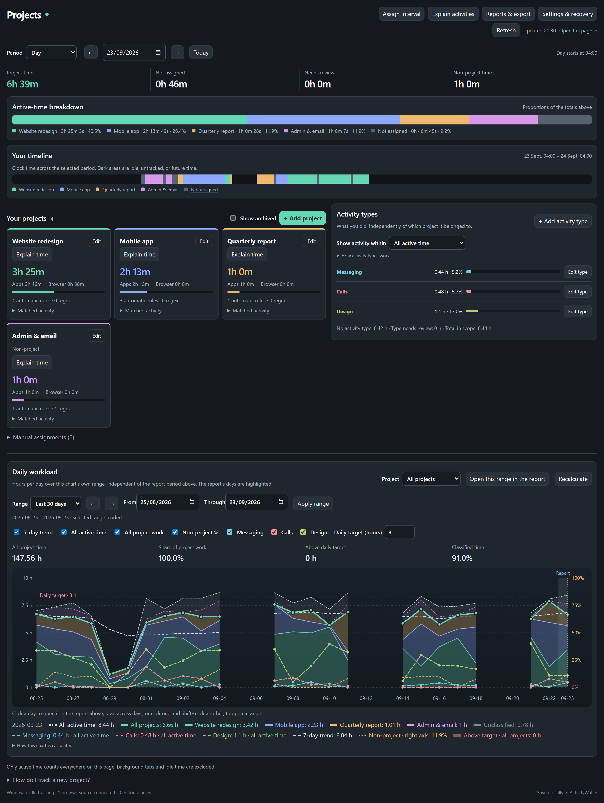
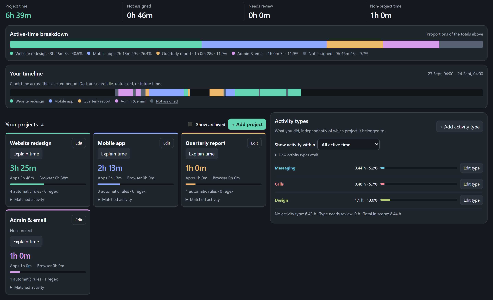
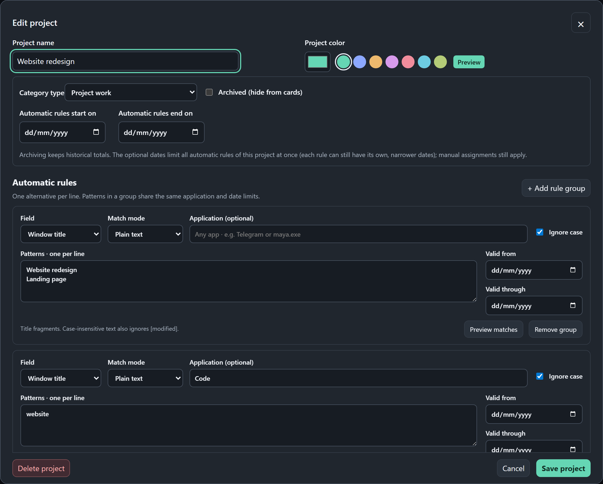
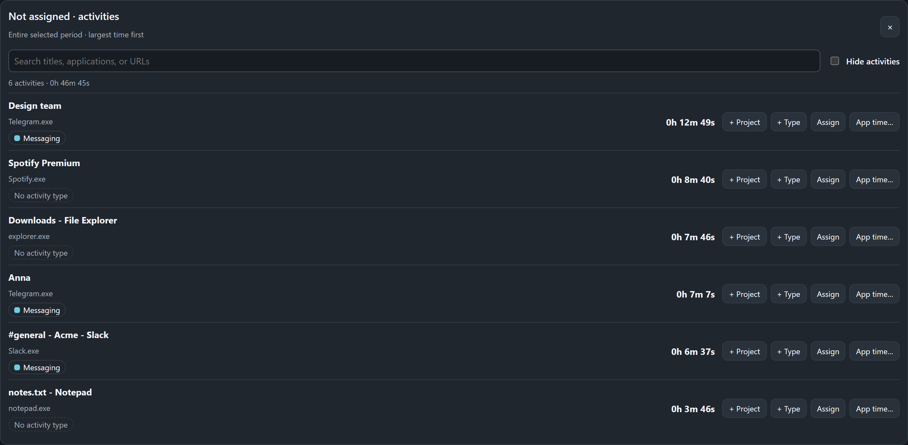
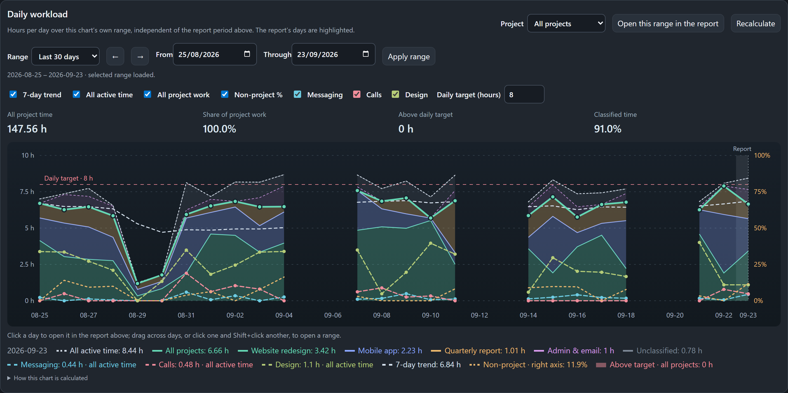
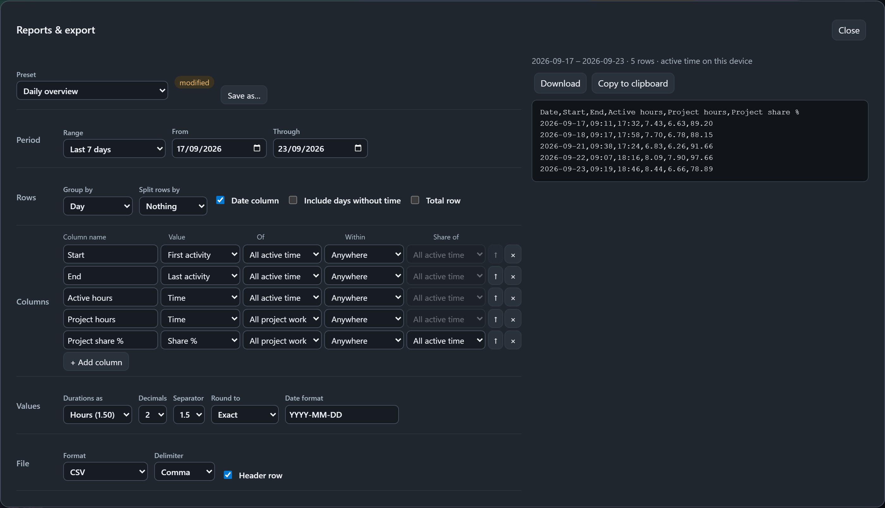

# ActivityWatch Projects

<p align="center">
  <a href="README.md"></a>
  <a href="README.ru.md"></a>
</p>

**Узнайте, куда уходит время, проведённое у монитора.**
ActivityWatch Projects превращает историю ActivityWatch в понятную картину времени по проектам: без таймеров, которые нужно запускать, и без ввода тегов или правил по каждой активности изо дня в день!



---

## Зачем

Я всегда пользовался другим таймтрекером, который более-менее удобно давал возможность сделать фильтр записей за день, чтобы посмотреть, сколько времени было потрачено на проект. В поисках альтернатив мне попадался и ActivityWatch, но на тот момент я не увидел в нём ничего удобного или полезного для себя.

На последнем проекте я решил испробовать какой-нибудь ещё инструмент отслеживания времени, так как простая строка поиска на каждый день - крайне неэффективно. И снова наткнулся на ActivityWatch. Как оказалось, из коробки его интерфейс не сильно полезен для подобных целей, но можно настроить свою собственную доску с правилами категоризации и сбора данных.

Что мне очень понравилось:
1. Не нужно вручную заводить какие-то таймеры. Система сама следит за всем, что открывается, и сортирует по правилам, которые вы же сами и задали
2. Две параллельные системы данных:
  - **Проектная** (рабочие задачи). То, что потом можно заносить в таблицу затраченного на работу времени
  - **Активности**. Очень интересно было увидеть, сколько времени я потратил, например, на переписки. Или сколько часов в день уходит на суперполезные созвоны в Zoom или подобных «пожирателях полезного времени»
3. Дата создания фильтра ни на что не влияет. Все записи в базе данных работают одинаково
4. Вся информация хранится локально

## Что внутри

### Проекты с первого взгляда
У каждого проекта своя карточка со своим цветом и настройками. Всё на странице показывается за выбранный период: день, неделю, месяц или любой диапазон, а кнопка **Today** сразу возвращает к сегодняшнему дню.



### Простые правила делают всю сортировку
Правила для сортировки можно задать разными способами:

- по слову в **заголовке окна**: `Blender` или `Квартальный отчёт`;
- по **целому приложению**: всё, что сделано во Figma или Telegram, что бы ни было в заголовке окна;
- по **адресу сайта**: конкретная доска, репозиторий или конкретный домен;
- по **файлу или папке** в VS Code или Obsidian (если установлены их вотчеры).

Правило можно ограничить одним приложением («только в Telegram») или периодом («этот чат относился к проекту до марта»). Для сложных случаев есть регулярные выражения.



### Ничего не потеряется
Кнопка **Not assigned** покажет всё, что ещё не разобрано, от самого большого к меньшему по времени. Прямо из строки можно:

- добавить правило в существующий или новый проект;
- добавить запись в **тип активности**;
- назначить только это время вручную, один раз, без правила;
- разом назначить всё время конкретного приложения.

У каждой строки видно, к каким типам активности она уже относится, так что сразу понятно, что осталось неразобранным.



### Типы активности: *что* вы делали, а не только *для кого*
Проекты отвечают на вопрос «для кого это было?». Типы активности отвечают на вопрос «чем я занимался?»: переписка, видео, дизайн, код, что угодно на ваш выбор. Они считаются независимо, поэтому один и тот же час может быть и *Клиентом А*, и *Перепиской*, не удлиняя ваш день. Тип описывается теми же правилами, что и проект: целое приложение, заголовок окна, сайт, регулярные выражения, даты.

### Ежедневная нагрузка
График часов по дням за неделю, месяц или любой период: по одному проекту или по всем сразу, с дневной нормой, 7-дневным трендом и долей непроектного времени. Длинные периоды умещаются на экран как средние по неделям или месяцам, а уже просмотренные дни открываются мгновенно: браузер запоминает завершённые дни, пока вы не поменяете правила. Дни, которые показывает отчёт выше, подсвечены; щёлкните по дню или протяните по нескольким, чтобы открыть их в отчёте.



### Отчёты и экспорт
Соберите ровно ту таблицу, которая нужна, и сохраните её как пресет. Строки — дни, недели, месяцы или весь период, при желании по строке на каждый проект или тип активности. Каждая колонка настраивается: время, доля времени, число сессий, самая длинная или средняя сессия, активные дни, начало или конец активности — для проекта, типа активности или всего времени, при желании только внутри другого проекта. «Дата – часы» по одному проекту, «доля созвонов в проекте X по дням» или «сколько раз и как долго я сидел в мессенджерах за неделю» — всё это несколько кликов. Время — в десятичных часах, минутах или ч:мм, при желании с округлением (например, до 6 или 15 минут); даты — в любом формате по шаблону, например `DD.MM.YYYY`, `ddd, D MMMM` или `YYYY-[W]WW`. Скачайте результат в **CSV**, **TSV**, **Markdown** или **JSON** либо скопируйте прямо в таблицу. Встроенные пресеты — отправная точка; ваши собственные хранятся в ActivityWatch. В экспорт попадают только цифры по времени, без заголовков окон и адресов.



### Можно смело экспериментировать
Перед сохранением любое изменение показывает цифры **«до → после»**. Последние 20 версий настроек хранятся, и любую из них можно вернуть в один клик.

## Как считается время

- Учитывается только **активное** время. Если ActivityWatch считает, что вас нет за компьютером, время никуда не идёт.
- Вкладка браузера считается, только пока браузер на переднем плане.
- Если одну минуту одновременно заявляют два проекта, она попадает в **Needs review**, а не считается дважды. Поправьте правила или назначьте её вручную.
- **Ручные назначения** всегда важнее автоматических правил.
- Время, отмеченное как **non-project** (личный сёрфинг, админка), учитывается, но не попадает в итоги проектов.
- День начинается тогда же, когда в ActivityWatch (по умолчанию в 04:00), поэтому ночная работа остаётся в правильном дне.

## Как начать

Нужен запущенный [ActivityWatch](https://activitywatch.net/) с вотчерами окон и AFK. Для правил по сайтам установите ещё браузерное расширение ActivityWatch.

1. **Установите.** Выберите систему:

   <details open>
   <summary><b>Windows</b> (PowerShell)</summary>

   ```powershell
   irm https://github.com/mr-asa/activitywatch-projects/releases/latest/download/install.ps1 | iex
   ```

   Ставится в `%LOCALAPPDATA%/ActivityWatchProjects`.
   </details>

   <details>
   <summary><b>Linux</b></summary>

   ```sh
   curl -fsSL https://github.com/mr-asa/activitywatch-projects/releases/latest/download/install.sh | sh
   ```

   Ставится в `~/.local/share/activitywatch-projects` (нужны `curl` или `wget` и `unzip`).
   </details>

   <details>
   <summary><b>macOS</b></summary>

   Та же команда, что и для Linux. Ставится в `~/Library/Application Support/ActivityWatchProjects`. Кнопки Update в один клик там нет: для обновления запустите команду снова.
   </details>

   <details>
   <summary><b>Вручную</b> (любая система)</summary>

   Скачайте `activitywatch-projects.zip` из [релизов](https://github.com/mr-asa/activitywatch-projects/releases), распакуйте папку `app` куда угодно и добавьте `projects = "<эта папка>"` в секцию `[server.custom_static]` файла `aw-server.toml`.
   </details>

   Скрипт скачает последний релиз и добавит одну строку в `aw-server.toml` ActivityWatch (сначала делается резервная копия).
2. **Один раз перезапустите ActivityWatch** и откройте <http://127.0.0.1:5600/pages/projects/>.
3. Нажмите **+ Add project**, задайте имя и правило, и история начнёт заполняться.

**Обновления.** Раз в сутки панель проверяет GitHub и, если вышла новая версия, показывает плашку с кнопкой **Update**: один клик устанавливает обновление и перезагружает страницу (Windows и Linux). Если кнопка ничего не делает, запустите команду установки ещё раз.

Проверено на Windows с ActivityWatch 0.14. Установщик для Linux и macOS проверен только на локальном пакете, не на реальной машине.

## Скорость работы

Открывайте ActivityWatch по адресу `http://127.0.0.1:5600`, а не `localhost:5600`. В Windows `localhost` сначала пробует IPv6, а ActivityWatch слушает только IPv4, поэтому каждый запрос теряет около 200 мс. Для панели, которая делает несколько запросов подряд, это секунды: первая загрузка отчёта ускоряется примерно с 3,3 до 0,3 с. Так быстрее работает и весь интерфейс ActivityWatch.

Настройки вида (период графика, фильтры, параметры экспорта) и кэш графика браузер хранит отдельно для каждого адреса, поэтому на новом адресе они сначала будут пустыми. Проекты, правила и пресеты хранятся в ActivityWatch и не зависят от адреса.

## Для разработчиков

Архитектура, модель данных, тесты и деплой описаны в [AGENTS.md](AGENTS.md) (на английском).
